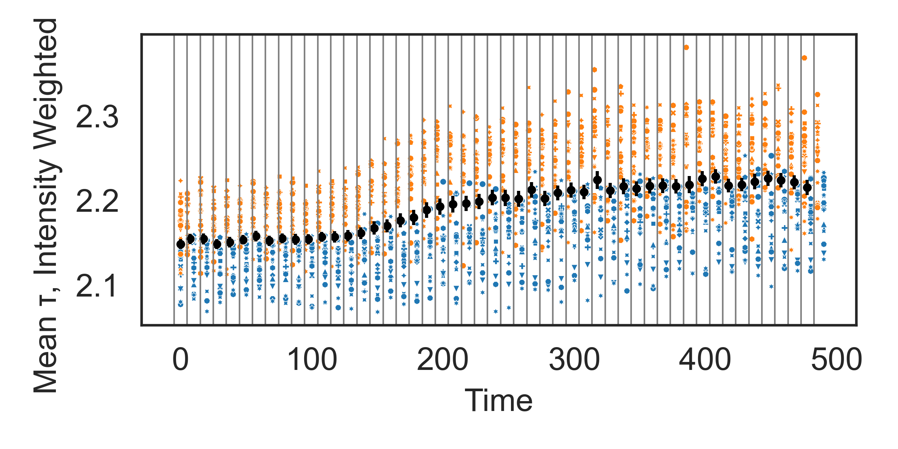
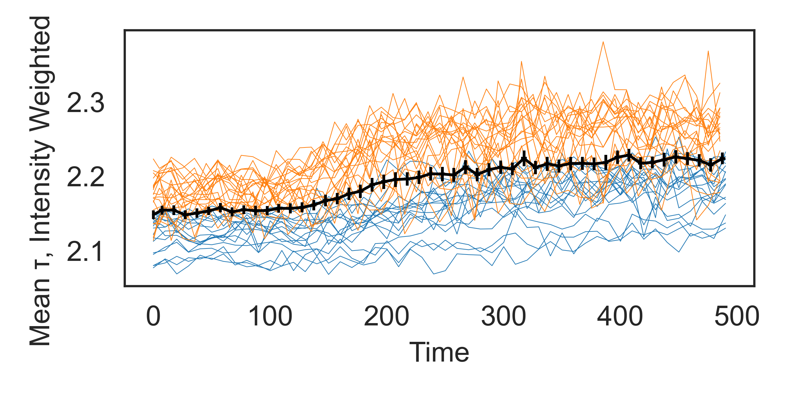

# Combining different datasets in a y(t) plot

.. when t series are not exactly consistent. 

See the file `plotting_together_t-y.py`.

My solution was to first determine bins based on the # of measurements 
and total amount of time, and then bin both the time data and 
y values accordingly.

See example plots below (and in `plots_examples_frozen/`). Grey vertical lines in 'plot1'
indicate bins. Coloring is per sample, symbols indicate ROIs. Same in 'plot2',
except that bin edges are not shown, and one line is shown per ROI.

## Further thinking

There might be more elegant solutions.
It’s still not perfect, as the bins at some point misalign with the interval between measurements. This causes a spike in the data if the data is different from one sample to another.

An alternative might be to slide over the time, and set a bin edge every time all samples have had a timepoint in that bin. 
